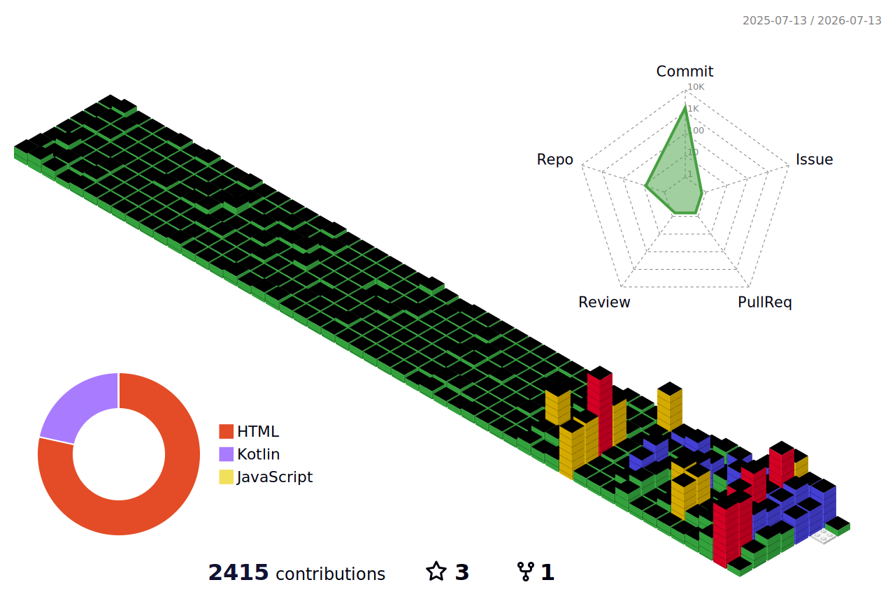

###

<!--
**Ina-dang/Ina-dang** is a ✨ _special_ ✨ repository because its `README.md` (this file) appears on your GitHub profile.

Here are some ideas to get you started:

- 🔭 I’m currently working on ...
- 🌱 I’m currently learning ...
- 👯 I’m looking to collaborate on ...
- 🤔 I’m looking for help with ...
- 💬 Ask me about ...
- 📫 How to reach me: ...
- 😄 Pronouns: ...
- ⚡ Fun fact: ...
-->

	

<h3 align="center">📚 Tech Stack 📚</h3>
<!-- Backend -->
<h4 align="center">Backend</h4>

<!-- DevOps -->
<h4 align="center">DevOps</h4>

<!-- Tools -->
<h4 align="center">Tools</h4>

<!-- AI & Prompt Engineering -->
<h4 align="center">AI & Prompt Engineering</h4>

    <h3> ✉️ Social ✉️ </h3>
    

  
