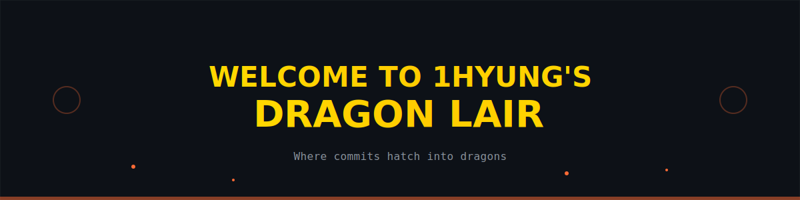

<!-- Dragon Header -->

  

<!-- Dragon Contribution Graph -->

  

<!-- Section Divider -->

<!-- Experience Section -->
<h2 align="center">
  
  Experience
  
</h2>

  
    
  
  
  
  
  
    
  

<!-- Section Divider -->
 

<!-- Tech Stack Section -->
<h2 align="center">
  
  Tech Stack
  
</h2>

<!-- Backend -->
<h4 align="center">Backend</h4>

  
  
  
  
  

<!-- DevOps -->
<h4 align="center">DevOps</h4>

  
  

<!-- Tools -->
<h4 align="center">Tools</h4>

  
  
  
  
  

<!-- AI & Prompt Engineering -->
<h4 align="center">AI & Prompt Engineering</h4>

  
  

<!-- Section Divider -->
 

<!-- Social Section -->
<h2 align="center">
  
  Social
  
</h2>

  

<!-- Section Divider -->
 

<!-- 3D Contribution Graph (keeping the existing one as a secondary display) -->

  

