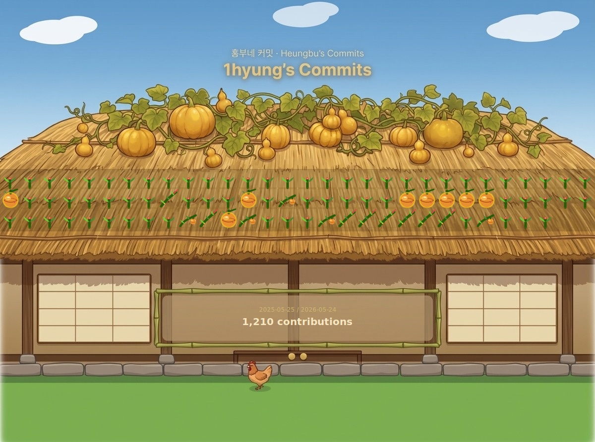

<!-- Heungbu Header -->

  

<h2 align="center">
  
  Experience
  
</h2>

  
    
  
  
  
  
  
    
  

<h2 align="center">
  
  Tech Stack
  
</h2>
<h4 align="center">Backend</h4>

  
  
  
  
  

<h4 align="center">DevOps</h4>

  
  

<h4 align="center">Tools</h4>

  
  
  
  
  

<h4 align="center">AI & Prompt Engineering</h4>

  
  

<h2 align="center">
  
  Social
  
</h2>

  

<!-- 흥부네 커밋 그래프 -->

  

